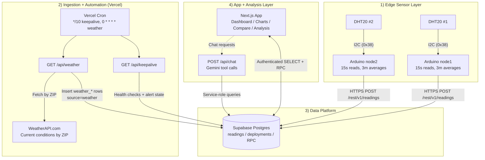

# IoT Temp/Humidity Dashboard

Real-time environmental monitoring from multiple sensor nodes with historical analytics, deployment tracking, and AI-powered data analysis.

## Architecture



Sensor nodes read temperature/humidity every 15 seconds, average over 3-minute windows, and POST to Supabase. An hourly cron route fetches outdoor weather by deployment ZIP code and writes companion `weather_*` rows to `readings`.

Detailed design and end-to-end flow: `docs/architecture.md`

## Communication Details

1. Sensor communication is I2C between DHT20 and MCU (`SDA`/`SCL`, DHT20 address `0x38`).
2. Each node samples every 15s, buffers readings locally, then computes a 3-minute average.
3. Each node sends JSON over HTTPS to Supabase REST:
   - Endpoint: `POST /rest/v1/readings`
   - Body: `{"device_id":"nodeX","temperature":<celsius>,"humidity":<percent>}`
4. Supabase writes rows to `readings` with server timestamp (`created_at`).
5. Next.js fetches live/historical data from Supabase using authenticated queries and RPC functions.

## Weather Ingestion Details

1. Active deployments can store an optional `zip_code` (validated as US ZIP or ZIP+4 in the deployment modal).
2. Vercel Cron calls `GET /api/weather` hourly (`0 * * * *`) using `CRON_SECRET`.
3. The route fetches active deployments with ZIP codes, normalizes ZIP values, and deduplicates WeatherAPI requests by ZIP.
4. It inserts one weather row per active sensor device into `readings` with:
   - `device_id`: `weather_<sensor_device_id>`
   - `source`: `weather`
   - `deployment_id`, `zip_code`, `observed_at`
5. Compare and AI flows use these `weather_*` device IDs to compare sensor vs outdoor conditions.

See board-specific details:
- `arduino/sensor_node/README.md` (Uno R4 WiFi)

## Features

- Live readings from multiple nodes (30s polling, offline detection after 5 min)
- Deployment tracking: group readings by device + location + time range
- Historical charts (1h/6h/24h/7d/custom) with device and deployment filters
- Side-by-side stats comparison (avg, min, max, stddev, delta) with weather rows and `% Error`
- AI chat with Gemini tool-calling (queries deployments, stats, readings)
- Hourly outdoor weather integration (WeatherAPI.com) tied to active deployment ZIP code
- AI report generation: ask the chatbot to write a structured analysis report for your paper
- Python statistical analysis (Pyodide): descriptive stats, correlation, hypothesis testing, seasonal decomposition, and Holt-Winters forecasting — runs entirely in the browser
- CSV export per time range
- Email monitoring alerts for stale/offline/anomalous sensor nodes (one alert per incident + optional recovery alert)
- Secure login via Supabase Auth
- Mobile-responsive layout

## Stack

| Layer | Tech |
|-------|------|
| Hardware | Arduino Uno R4 WiFi, DHT20 (I2C), 16x2 LCD |
| Database | Supabase Postgres |
| Auth | Supabase Auth (email/password) |
| Web | Next.js 16 (App Router), Nivo charts |
| AI | Google Gemini 2.5 Flash |
| Browser Python | Pyodide (numpy, pandas, scipy, statsmodels) |
| Hosting | Vercel |

## Data Model

| Table | Purpose |
|-------|---------|
| `readings` | Temperature (Celsius) and humidity per device. Includes both sensor and weather records via `source` (`sensor` or `weather`) plus weather metadata (`deployment_id`, `zip_code`, `observed_at`). Converted to Fahrenheit in UI. |
| `deployments` | Device placement sessions: device + location + time range, plus optional `zip_code` used for hourly weather lookup. Readings associate by matching `device_id` and `created_at` within the window. |
| `device_alert_state` | Monitoring state per device for keepalive alert transitions (`ok`, `missing`, `stale`, `anomaly`) and alert timestamps. |

Device IDs: `node1`, `node2` (sensor), and `weather_node1`, `weather_node2` (hourly outdoor weather companions).

## Two-Node Deployment

This repository is structured for dual-node operation:

| Node ID | Typical Board | Firmware Path | Purpose |
|---------|---------------|---------------|---------|
| `node1` | Uno R4 WiFi | `arduino/sensor_node/` | Primary measurement point |
| `node2` | Uno R4 WiFi | `arduino/sensor_node/` | Secondary measurement point |

To verify two-node operation:
1. Flash one device with `#define DEVICE_ID "node1"`.
2. Flash the second device with `#define DEVICE_ID "node2"`.
3. Confirm both IDs appear in dashboard cards and in the `readings` table.

## API Routes

| Route | Auth | Purpose |
|-------|------|---------|
| `POST /api/chat` | Required | AI chat with tool-calling. Accepts `{ message, history }`. Streams response. |
| `GET /api/keepalive` | CRON_SECRET | Cron health check + device monitoring + optional email alerts (one alert per incident + optional recovery alert). |
| `GET /api/weather` | CRON_SECRET | Hourly weather ingestion route. Fetches WeatherAPI current conditions by active deployment ZIP and writes `weather_*` readings. |

The `/analysis` page runs entirely client-side using Pyodide (no API route needed). Python packages load from CDN on first visit (~15MB, cached by the browser afterward).

## Security

- **RLS**: Authenticated users only for SELECT on dashboard data.
- **Device writes**: Anon INSERT for Arduino fast path. Trade-off: data integrity relies on key secrecy rather than per-device auth.
- **API routes**: Return 401 if unauthenticated or missing secret.
- **Server-only secrets**: `SUPABASE_SERVICE_ROLE_KEY`, `GOOGLE_API_KEY`, and `WEATHER_API_KEY` never exposed to client. Service role key bypasses RLS only after auth/secret checks at the request level.

## Setup

### 1. Supabase

1. Create project at [supabase.com](https://supabase.com)
2. Run `supabase/schema.sql` in SQL Editor
3. Grab from **Settings > API**: Project URL, `anon` public key, `service_role` secret key

### 2. Supabase Auth

1. Go to **Authentication > Users > Add user**
2. Create a user with email + password
3. Enable "Auto Confirm User" (or confirm manually)

### 3. Web (Local Dev)

```bash
cd web
cp .env.example .env.local
# Fill in your keys (see Env Vars below)
npm install
npm run dev
```

Open [http://localhost:3000](http://localhost:3000) and log in with your Supabase Auth user.

### 4. Arduino

Choose your board path:
- `arduino/sensor_node/` (Uno R4 WiFi)

Two-node checklist:
- Device A: set `DEVICE_ID` to `node1`
- Device B: set `DEVICE_ID` to `node2`
- Put each node at a different location and verify both stream concurrently

Example (Uno R4 WiFi):
```bash
cd arduino/sensor_node
cp secrets.example.h secrets.h
# Fill in WiFi + Supabase credentials
# Set DEVICE_ID to "node1" or "node2"
# Upload via Arduino IDE
```

## Deploy to Vercel

1. Push repo to GitHub
2. Import in [Vercel](https://vercel.com), set **Root Directory** to `web`
3. Add env vars (see table below)
4. Deploy
5. (Optional) Verify Vercel Cron jobs in `web/vercel.json`:
   - `/api/keepalive` every 10 minutes (`*/10 * * * *`)
   - `/api/weather` hourly (`0 * * * *`)

Arduinos connect automatically once `secrets.h` is configured.

## Circuit and Measurement Evidence

Add photos/screenshots to `docs/images/` and reference them here.

- `docs/images/node1-circuit.jpg` - Node 1 breadboard/wiring
- `docs/images/node2-circuit.jpg` - Node 2 breadboard/wiring
- `docs/images/measurement-setting.jpg` - Physical placement/measurement setting
- `docs/images/dashboard-two-nodes.png` - Dashboard showing both `node1` and `node2`
- `docs/images/supabase-readings-proof.png` - Supabase table rows from both nodes

Photo checklist template is provided in `docs/images/README.md`.

## Project Structure

```
├── arduino/sensor_node/       # Uno R4 firmware + wiring docs
├── docs/architecture.md       # End-to-end system architecture details
├── docs/images/               # Circuit + deployment photo evidence
├── supabase/schema.sql        # Tables, RLS policies, RPC functions
├── web/src/
│   ├── app/
│   │   ├── page.tsx           # Live dashboard
│   │   ├── charts/            # Historical charts
│   │   ├── compare/           # Stats comparison
│   │   ├── analysis/          # Pyodide statistical analysis
│   │   ├── deployments/       # Deployment management
│   │   ├── login/             # Auth page
│   │   └── api/               # chat, keepalive, weather
│   ├── components/
│   │   ├── AuthProvider.tsx    # Auth context
│   │   ├── AuthGate.tsx       # Route protection
│   │   ├── Navbar.tsx
│   │   ├── LiveReadingCard.tsx
│   │   ├── DeploymentModal.tsx
│   │   ├── AIChat.tsx
│   │   └── analysis/          # Analysis result display components
│   └── lib/
│       ├── supabase.ts        # Client + queries + RPC wrappers
│       ├── auth.ts            # signIn, signOut, getSession
│       ├── serverAuth.ts      # Server-side session check
│       ├── aiTools.ts         # Gemini tool execution
│       ├── pyodide.ts         # Pyodide loader singleton
│       ├── analysisRunner.ts  # Python analysis scripts + data bridge
│       ├── weatherZip.ts      # ZIP validation + weather device ID helpers
│       └── weatherCompare.ts  # Compare-page weather pairing + % error helper
```

## Env Vars

| Var | Where | Notes |
|-----|-------|-------|
| `NEXT_PUBLIC_SUPABASE_URL` | Vercel + local | Public |
| `NEXT_PUBLIC_SUPABASE_ANON_KEY` | Vercel + local | Public |
| `SUPABASE_SERVICE_ROLE_KEY` | Vercel + local | **Secret**, server-only |
| `GOOGLE_API_KEY` | Vercel + local | Server-only, Gemini |
| `WEATHER_API_KEY` | Vercel + local | Server-only, WeatherAPI.com key for `/api/weather` |
| `CRON_SECRET` | Vercel + local | Protects `/api/keepalive` and `/api/weather` |
| `RESEND_API_KEY` | Vercel + local | Server-only, sends alert emails |
| `ALERT_EMAIL_TO` | Vercel + local | Comma-separated recipients |
| `ALERT_EMAIL_FROM` | Vercel + local | Optional sender identity for alerts |
| `MONITORED_DEVICE_IDS` | Vercel + local | Device list, default `node1,node2` |
| `ALERT_STALE_MINUTES` | Vercel + local | Stale threshold, default `10` |
| `ENABLE_RECOVERY_ALERTS` | Vercel + local | Send recovery emails when node returns to OK |
| `ALERT_DASHBOARD_URL` | Vercel + local | Optional dashboard URL in alert body |

```bash
NEXT_PUBLIC_SUPABASE_URL=https://your-project.supabase.co
NEXT_PUBLIC_SUPABASE_ANON_KEY=your-anon-key
SUPABASE_SERVICE_ROLE_KEY=your-service-role-key
GOOGLE_API_KEY=your-google-api-key
WEATHER_API_KEY=your-weather-api-key
CRON_SECRET=some-random-secret
RESEND_API_KEY=re_...
ALERT_EMAIL_TO=you@example.com
MONITORED_DEVICE_IDS=node1,node2
ALERT_STALE_MINUTES=10
ENABLE_RECOVERY_ALERTS=true
```

Monitoring behavior:
- A problem alert is sent once when a device first enters `missing`, `stale`, or `anomaly`.
- No repeated alerts are sent while the device remains in the same problem state.
- If enabled, one recovery alert is sent when the device returns to `ok`.
- `MONITORED_DEVICE_IDS` controls which devices are evaluated (set this to `node1` if node2 is not deployed yet).

## Disabling Auth

To run as a fully public dashboard:

1. Remove `<AuthGate>` wrappers from pages
2. Revert RLS policies to allow `anon` SELECT

## Performance Notes

- **Server-side aggregation**: Charts and stats use Postgres RPC functions (`get_device_stats`, `get_chart_samples`, `get_deployment_stats`) to avoid transferring raw readings to the client.
- **Bucketing**: Chart queries downsample readings into time buckets (3min for ≤6h, 6min for ≤24h, 30min for ≤7d, 1h for longer ranges). Bucket sizes are tuned for the 3-minute device sampling interval.
- **AI guardrails**: Tool calls cap result sizes (max deployment IDs, max readings per query, 10-iteration tool-call loop limit).
- **Pyodide caching**: The Python runtime and packages (~15MB) are loaded from CDN once and cached by the browser. A module-level singleton keeps the instance alive across page navigations within the same session.
- **Polling**: Dashboard refreshes every 30s. Sensors average over 3 minutes to reduce write volume.

## Trade-offs

- **Shared login** instead of per-user accounts. Simpler ops, no user management overhead.
- **Anon INSERT for devices** keeps firmware simple. Data integrity relies on key secrecy rather than per-device authentication.
- **No foreign key between readings and deployments.** Association is implicit via `device_id` + timestamp window. Simpler schema, but queries must always join on time bounds.

## Troubleshooting

**Can't log in**
- Verify the Supabase Auth user exists and is confirmed
- Try lowercase email

**Arduino won't connect to WiFi**
- Check `secrets.h` SSID/password
- If using Uno R4 WiFi, use a 2.4GHz network

**No data in dashboard**
- Check Supabase table for rows
- Verify env vars (check browser console for errors)
- Confirm you're logged in

**Charts/Compare pages empty**
- Run the latest `schema.sql` — RPC function signatures may have changed
- Verify `EXECUTE` is granted to `authenticated` role

**Analysis page stuck on "Loading Python runtime..."**
- Check browser console for network errors
- Pyodide loads from `cdn.jsdelivr.net` — verify it's not blocked by your network
- First load can take 10–30s depending on connection speed
- If it fails, click the Retry button

**AI chat not responding**
- Confirm `GOOGLE_API_KEY` is set
- Confirm `SUPABASE_SERVICE_ROLE_KEY` is set (server-side)
- Check browser console for errors
- AI routes require authentication

**/api/keepalive returns 401**
- Set `CRON_SECRET` in env vars
- Vercel Cron must send `Authorization: Bearer <CRON_SECRET>` header

**/api/weather returns 401**
- Set `CRON_SECRET` in env vars
- Ensure manual calls include `?secret=<CRON_SECRET>` or `Authorization: Bearer <CRON_SECRET>`

**Weather rows are missing in Compare or `% Error` shows `—`**
- Ensure deployment has a valid ZIP (`12345` or `12345-6789`)
- Confirm `WEATHER_API_KEY` is set in Vercel/local env
- Trigger `/api/weather` manually and check response `errors` field

**/api/keepalive monitoring fails with `device_alert_state` error**
- Run the latest `supabase/schema.sql` so `device_alert_state` exists

**No alert emails received**
- Set `RESEND_API_KEY` and `ALERT_EMAIL_TO`
- For custom sender addresses, verify your domain in Resend and set `ALERT_EMAIL_FROM`

**Alerts for node2 even though node2 is not deployed**
- Set `MONITORED_DEVICE_IDS=node1` in your environment so only deployed devices are monitored

## License

MIT
