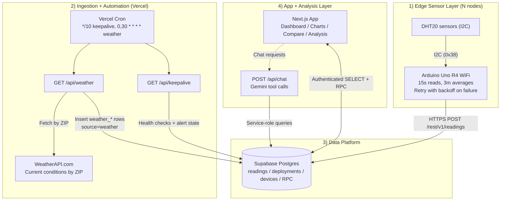

# IoT Temp/Humidity Dashboard

A full-stack IoT platform for collecting temperature and humidity from Arduino sensor nodes, comparing readings against local weather references, and analyzing the data through charts, statistics, and AI. Built as an educational project for an intro engineering class.

Arduino Uno R4 WiFi nodes with DHT20 sensors post averaged readings to Supabase every 3 minutes. The system supports any number of sensor nodes — devices are registered and managed through the web dashboard, so adding a new node is just flashing a sketch and clicking "Add Device." A Vercel cron fetches weather every 30 minutes from WeatherAPI.com for each node's deployment location. The web dashboard shows live data, historical charts, side-by-side comparisons with `% Error` against weather, deployment management, in-browser Python analysis via Pyodide, and an AI chat powered by Gemini.

## Architecture

## Pages

| Route | Purpose |
|-------|---------|
| `/` | Live readings per device, deployment context, 24h stats, 7-day forecast, device management |
| `/charts` | Historical trends with time range selector + CSV export |
| `/compare` | Side-by-side stats per device, weather reference, `% Error` |
| `/deployments` | Manage placement windows and ZIP codes |
| `/analysis` | In-browser Python stats and forecasting (Pyodide) |
| `/api/chat` | AI chat backend (floating chat shell available on every page) |

## Tech Stack

| Layer | Tech |
|-------|------|
| Hardware | Arduino Uno R4 WiFi + DHT20 (I2C) |
| Database | Supabase Postgres + Auth + RLS |
| Web | Next.js 16 (App Router), Vercel |
| AI | Gemini 2.5 Flash (tool-calling) |
| Analysis | Pyodide (numpy, pandas, scipy, statsmodels) |
| Weather | WeatherAPI.com (free tier) |

## Docs

| Doc | Contents |
|-----|----------|
| [SETUP.md](SETUP.md) | Local dev, Vercel deploy, env vars, Arduino setup, troubleshooting |
| [ARCHITECTURE.md](ARCHITECTURE.md) | Data flow, schema, RPC functions, trust boundaries, failure modes |
| [arduino/sensor_node/README.md](arduino/sensor_node/README.md) | Firmware, wiring, hardware notes |

## Hardware

<!-- Add your own photos below -->
<!--  -->
<!--  -->

## License

MIT
