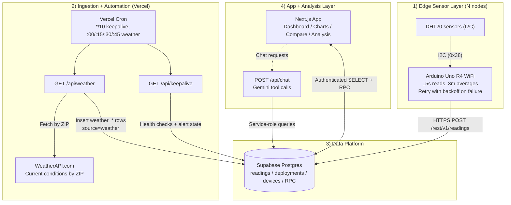
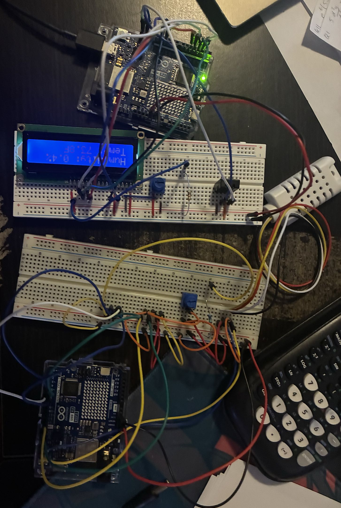
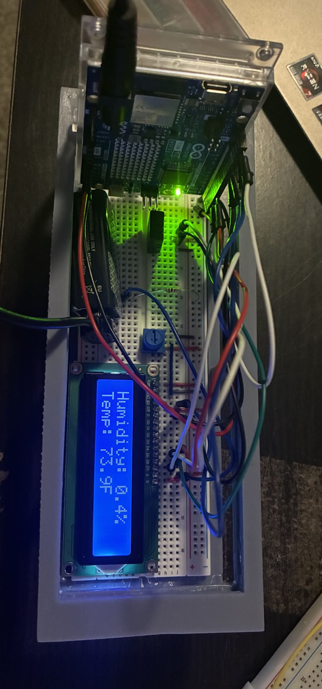

# IoT Temp/Humidity Dashboard

A full-stack IoT platform for collecting temperature and humidity from Arduino sensor nodes, comparing readings against local weather references, and analyzing the data through charts, statistics, and AI. Built as an educational project for an intro engineering class.

Arduino Uno R4 WiFi nodes with DHT20 sensors post averaged readings to Supabase every 3 minutes. The system supports any number of sensor nodes — devices are registered and managed through the web dashboard, so adding a new node is just flashing a sketch and clicking "Add Device." A Vercel cron fetches weather every 15 minutes from WeatherAPI.com for each node's deployment location. The web dashboard shows live data, historical charts, side-by-side comparisons with `% Error` against weather, deployment management, in-browser Python analysis via Pyodide, and an AI chat powered by Gemini.

## Architecture

```mermaid
flowchart TB
  subgraph edge["1) Edge Sensor Layer (N nodes)"]
    dht["DHT20 sensors (I2C)"]
    nodes["Arduino Uno R4 WiFi<br/>15s reads, 3m averages<br/>Retry with backoff on failure"]
    dht -->|"I2C (0x38)"| nodes
  end

  subgraph ingest["2) Ingestion + Automation (Vercel)"]
    cron["Vercel Cron<br/>*/10 keepalive, :00/:15/:30/:45 weather"]
    keepalive["GET /api/keepalive"]
    weatherRoute["GET /api/weather"]
    wx["WeatherAPI.com<br/>Current conditions by ZIP"]
    cron --> keepalive
    cron --> weatherRoute
    weatherRoute -->|"Fetch by ZIP"| wx
  end

  subgraph data["3) Data Platform"]
    db[("Supabase Postgres<br/>readings / deployments / devices / RPC")]
  end

  subgraph app["4) App + Analysis Layer"]
    ui["Next.js App<br/>Dashboard / Charts / Compare / Analysis"]
    chat["POST /api/chat<br/>Gemini tool calls"]
  end

  nodes -->|"HTTPS POST /rest/v1/readings"| db
  keepalive -->|"Health checks + alert state"| db
  weatherRoute -->|"Insert weather_* rows<br/>source=weather"| db
  ui <-->|"Authenticated SELECT + RPC"| db
  chat -->|"Service-role queries"| db
  ui -. "Chat requests" .-> chat
```

## Pages

| Route | Purpose |
|-------|---------|
| `/` | Live readings per device, deployment context, 24h stats, device management |
| `/charts` | Historical trends with time range selector, CSV export, Save PNG |
| `/compare` | Side-by-side stats per device, weather reference, `% Error` |
| `/deployments` | Manage placement windows and ZIP codes |
| `/analysis` | In-browser Python stats, ANOVA, confidence intervals, forecasting (Pyodide) |
| `/api/chat` | AI chat backend (floating chat shell available on every page) |

## Tech Stack

| Layer | Tech |
|-------|------|
| Hardware | Arduino Uno R4 WiFi + DHT20 (I2C) |
| Database | Supabase Postgres + Auth + RLS |
| Web | Next.js 16 (App Router), Vercel |
| AI | Gemini 2.5 Flash (tool-calling) |
| Analysis | Pyodide (numpy, pandas, scipy, statsmodels) |
| Weather | WeatherAPI.com (free tier) |

## Test Coverage

328 tests across 35 test files. Coverage is generated on every push via CI and uploaded as a build artifact.

| Category | Statements | Branches | Functions | Lines |
|----------|-----------|----------|-----------|-------|
| **Overall** | 72% | 64% | 68% | 74% |
| API routes | 78-93% | 67-88% | 83-100% | 79-93% |
| Components | 68% | 62% | 59% | 71% |
| Lib/utilities | 78% | 70% | 80% | 80% |
| Supabase queries | 95-100% | 84-100% | 100% | 98-100% |
| Contexts/providers | 60-100% | 50-100% | 60-100% | 65-100% |

High-coverage areas: Supabase query layer (devices, readings, deployments), API routes (chat, weather), utility modules (format, weatherZip, weatherCompare, conversions, auth), and core components (AuthGate, FilterToolbar, ChatShell, DeviceManager, ExportModal).

## Docs

| Doc | Contents |
|-----|----------|
| [SETUP.md](SETUP.md) | Local dev, Vercel deploy, env vars, Arduino setup, troubleshooting |
| [ARCHITECTURE.md](ARCHITECTURE.md) | Data flow, schema, RPC functions, trust boundaries, failure modes |
| [arduino/sensor_node/README.md](arduino/sensor_node/README.md) | Firmware, wiring, hardware notes |
| [DESIGN.md](DESIGN.md) | Design decisions, rationale, challenges, retrospective |
| [TESTING.md](TESTING.md) | Test suite, running tests, coverage |

## Hardware

Arduino Uno R4 WiFi with DHT20 sensor (I2C) and 16x2 LCD on a breadboard. The LCD displays live temperature and humidity; the board uploads 3-minute averaged readings to Supabase over HTTPS.

## Screenshots

## License

MIT
