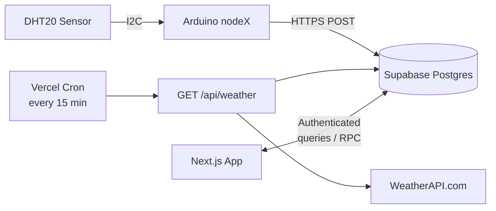
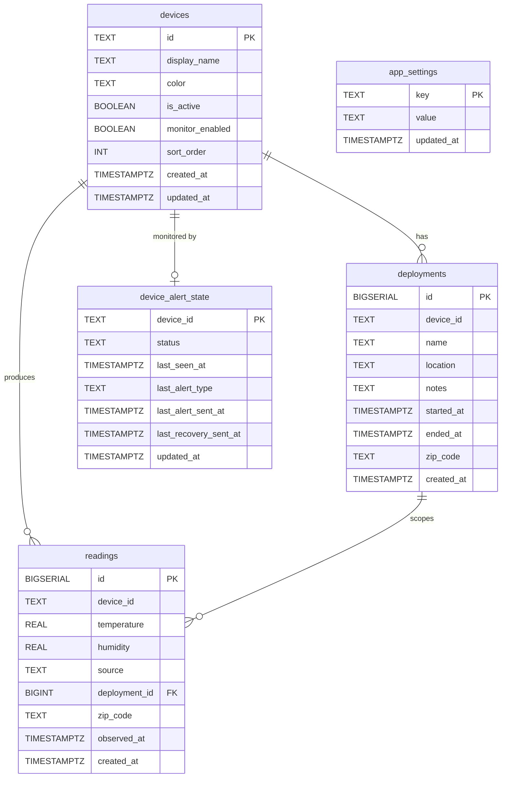

# System Architecture

Full data path from sensor read to dashboard consumption.

## 1) Scope

- Hardware: N Arduino Uno R4 WiFi nodes with DHT20 sensors (I2C) and 16x2 LCDs. The number of nodes is not hardcoded — new devices are registered through the web dashboard or auto-registered on first reading.
- Cloud: Supabase Postgres (`readings`, `deployments`, `devices`, `app_settings`, `device_alert_state`, `user_roles`, RPC functions) + WeatherAPI.com for every-15-min weather reference.
- App: Next.js with authenticated dashboard, charts, comparisons, deployment management, device management, AI chat with function calling, chat-driven LaTeX report generation (downloadable .tex + Overleaf hand-off), and cron-driven weather ingestion.

## 2) Component Topology



Nodes are dynamically registered in the `devices` table. The dashboard, keepalive, and weather routes all read from this table to determine which devices exist and which are active.

## 3) Sensor Node Pipeline

### 3.1 Read

- DHT20 temperature + humidity every `READ_INTERVAL_MS = 15000` (15s).
- I2C address `0x38` on `SDA`/`SCL`.
- Invalid reads (`NaN`) are discarded.

### 3.2 Aggregation

- Successful reads accumulate in local sums.
- Every `SEND_INTERVAL_MS = 180000` (3 min), compute average temperature (C) and humidity (%).

### 3.3 Uplink

- One HTTPS POST per 3-minute window to `/rest/v1/readings`:

```json
{
  "device_id": "node1",
  "temperature": 22.55,
  "humidity": 45.15
}
```

- `created_at` set server-side by Supabase.
- On success: accumulators reset, timer restarts.
- On failure: buffer is retained and the node retries with linear backoff (30s, 60s, 90s, 120s... capped at `SEND_INTERVAL_MS`). No data is lost during transient network issues.

## 4) Persistence Layer (Supabase)

### 4.1 Tables

**`readings`**
- `id` (bigserial PK), `device_id`, `temperature` (C), `humidity`, `created_at`, `source`, `deployment_id`, `zip_code`, `observed_at`
- `source` constrained to `sensor` (default) or `weather`
- Weather inserts use `device_id = weather_<sensor_device_id>`
- Index on `(device_id, created_at DESC)`
- Soft dedup on 15-minute buckets in route code; DB unique index on `(device_id, quarter_hour(created_at UTC))` as fallback for `source = weather`

**`deployments`**
- Placement window metadata: `device_id`, `name`, `location`, `zip_code`, `notes`, `owner_id`, `started_at`, `ended_at`
- DB constraints validate device ID format, text lengths, ZIP format, time ordering, and a foreign key to registered devices. A trigger rejects inserts for inactive/unregistered devices and blocks changing `device_id` after creation.
- Optional unique-active constraint per `device_id` where `ended_at IS NULL`
- Overlap exclusion constraint prevents conflicting time windows per device

**`devices`**
- Device registry: `id` (primary key), `display_name`, `color`, `is_active`, `monitor_enabled`, `sort_order`, `created_at`, `updated_at`
- Managed through the Device Manager UI on the dashboard
- `is_active` controls visibility in the dashboard; `monitor_enabled` controls keepalive alerting
- Auto-registration trigger creates a `devices` row when a new `device_id` appears in `readings` (gated behind `app_settings.device_auto_register = 'true'`)
- Seeded with `node1` and `node2` on first schema run; backfills from existing readings and deployments

**`app_settings`**
- Key-value feature flags (e.g., `device_auto_register`)
- Authenticated users can read; updates require authenticated session

**`device_alert_state`**
- Per-device monitor state: `status`, `last_seen_at`, `last_alert_sent_at`, `last_recovery_sent_at`
- Keepalive route uses this to deduplicate incident and recovery notifications

### 4.2 Security (RLS)

RLS enabled on all tables.

| Table | `anon` | `authenticated` | `service_role` |
|-------|--------|-----------------|----------------|
| `readings` | INSERT (validated: device_id regex `^[a-z0-9_-]{1,32}$`, no `weather_` prefix, temp -50..100, humidity 0..100, `source='sensor'`, `deployment_id/zip_code/observed_at` must be null) | SELECT | DELETE |
| `deployments` | — | SELECT; INSERT own rows; UPDATE own rows or admin; DELETE admin-only | — |
| `devices` | — | SELECT; INSERT/UPDATE/DELETE admin-only (checked against `user_roles`) | — |
| `app_settings` | — | SELECT; UPDATE admin-only | — |
| `device_alert_state` | — | SELECT | (service_role bypasses RLS; keepalive upserts via service_role) |
| `user_roles` | — | SELECT own row | Full CRUD (service_role manages roles) |
| `cron_runs` | — | — | Full access (service_role only; used by `claim_cron_run` RPC for cron idempotency) |
| `role_change_audit` | — | — | Full access (service_role only; `/api/users` writes an audit row per role change) |

Writes also have a belt-and-suspenders trigger (`reject_anon_weather_writes`) that blocks anon from inserting `weather_*` rows even if the policy above were ever relaxed.

`/api/weather` uses service_role + `CRON_SECRET` and now also claims its cron slot via `claim_cron_run` to avoid duplicate weather fetches and email floods if the provider double-fires.

### 4.3 RPC Functions

| Function | Purpose |
|----------|---------|
| `get_device_stats(start, end, device_id?)` | Aggregate avg/min/max/stddev/count by device |
| `get_chart_samples(start, end, bucket_min, device_id?)` | Time-bucketed averages for charts |
| `get_deployment_stats(deployment_ids[])` | Deployment-scoped aggregates via time window |
| `get_deployment_readings(deployment_id, limit?)` | Raw readings within a deployment window |
| `get_deployments_with_counts(device_id?, active_only?)` | Deployments with reading counts |
| `get_dashboard_live(device_ids[], sparkline_start, bucket_min?)` | Batched latest readings + sparkline per N devices |
| `get_report_bundle(start, end, device_ids?)` | Single-round-trip data bundle for LaTeX report generation: deployments, per-deployment and overall stats, hourly-of-day averages (Phoenix TZ), per-device hourly + daily summaries, daily sensor-vs-weather comparison, Pearson correlation, IQR outliers, and >3h gap detection inside active deployment windows |
| `delete_deployment_cascade(deployment_id)` | Cascade-delete deployment and its readings (admin-only, enforced via `user_roles` lookup on `auth.uid()`) |
| `delete_readings_range(device_id, start, end, include_weather?)` | Scoped deletion of readings by device and time range (admin-only, enforced via `user_roles` lookup on `auth.uid()`) |
| `delete_reading_by_id(p_id)` | Single-row delete used by the Data Explorer review flow (admin-only, enforced via `user_roles` lookup on `auth.uid()`) |
| `claim_cron_run(route, min_interval_ms)` | Cron idempotency guard. Called from `/api/keepalive` and `/api/weather` at the top of each request; returns TRUE only if enough time has passed since the last successful claim. Service-role only. |

Weather data lives in `readings`, so all RPCs work with weather device IDs (e.g., `weather_node1`).

### 4.4 Schema Diagram



## 5) Web Application

All pages require Supabase Auth session (`AuthGate`). The root layout wraps the app in `ThemeProvider` > `AuthProvider` > `PostHogProviderWrapper` > `DevicesProvider` > `ChatPageContextProvider`, making the device list, analytics, and chat context available everywhere.

Auth supports two roles: `admin` and `user`. Roles are stored in a `user_roles` table and injected into the JWT via a Custom Access Token Hook. Both roles can read all data. Users can create deployment metadata and edit deployments they own; admins can edit any deployment. Admins alone can delete deployments/readings and manage devices/users — enforced at the RLS, RPC, and server-route layer via a direct `user_roles` lookup on `auth.uid()` (so role changes take effect immediately rather than waiting for JWT refresh). A middleware layer (`middleware.ts`) refreshes sessions and redirects unauthenticated users to `/login`. Every admin-driven role change (invite, promote, demote, delete) writes a row to `role_change_audit`.

Optional PostHog integration provides product analytics (autocapture, session replay, error tracking) when `NEXT_PUBLIC_POSTHOG_KEY` is configured. Traffic routes through a managed reverse proxy to bypass ad blockers. PostHog is not required — if the env var is unset, the provider renders children without instrumentation.

### 5.1 Dashboard (`/`)

- Polls every 30s using `get_dashboard_live` RPC (batched query for all active devices).
- Renders live cards per device with deployment context, weather comparison, and 6h sparklines.
- `DashboardStats`: 24h aggregates (avg temp, high/low, uptime %, sensor accuracy vs weather). Uptime is computed per device based on active deployment start time.
- Offline notification banner: queries `device_alert_state` table and shows a warning when any device is stale/missing/anomaly. Dismissible per session.
- Device Manager modal: add/edit/deactivate devices, toggle monitoring, assign colors.
- Floating `ChatShell` available on all pages (mounted in root layout).

### 5.2 Charts (`/charts`)

- Time range: preset, custom, or deployment window.
- Bucket size dynamically chosen targeting ~100 data points: 5min for short ranges, 15min for 24h, 2-3h for 7d.
- CSV export fetches raw readings, excludes `weather_*` rows. Export modal supports deployment selection (auto-fills dates/device, prepends CSV metadata headers).
- Save PNG button exports the chart as a 2x resolution PNG image for reports.

### 5.3 Compare (`/compare`)

- Dynamically fetches `get_device_stats` for all active sensor + weather device pairs.
- Displays Weather row and `% Error` row per metric.
- `% Error` = each sensor node vs its local weather counterpart (not node vs node).
- Celsius converted to Fahrenheit for display.

### 5.4 Deployments (`/deployments`)

- Create/update deployment metadata with device/location/status filters. Users may edit only their own deployments; admins may edit any deployment.
- Device filter populated from the `devices` table.
- Optional ZIP code (`12345` or `12345-6789`) for weather lookups.
- Admin-only deletion removes associated readings in the deployment time window.
- Admin-only Clean Up Data modal: scoped deletion of readings by device + time range with password re-entry confirmation. Uses `delete_readings_range` RPC.

### 5.5 Report Generation (chat-driven, `/api/reports/*`)

Replaced an earlier in-browser Pyodide analysis page. The flow is entirely chat-driven now:

- Ask the floating AI chat to generate a report. It asks once for a date range, then calls `prepare_report`, which runs `get_report_bundle` against Supabase, caches the bundle in Redis (30-min TTL), and injects a `__QUESTION__<json>` marker into the chat stream. The marker carries the available devices, pre-fill defaults (title, author from Supabase auth, institution, etc.), and a bundle summary.
- The client parses the marker and opens `ReportOptionsModal`, which lets the user adjust author/title/options, toggle per-device inclusion (defaults to all), and confirm. Generation skips the chat Gemini entirely — the modal POSTs directly to `/api/reports/generate`.
- `/api/reports/generate` validates the user, checks `reportLimiter` (5/hour), re-fetches a device-scoped bundle if the user narrowed selection, runs an isolated Gemini 2.5 Flash call (`reportProse.ts`) to produce a structured JSON of analytical prose (with per-section fallbacks and a forbidden-phrase filter that nulls any causal/forward-looking/hardware speculation), and assembles the `.tex` via `reportTemplate.ts`. The `.tex` is stored in Redis for 30 minutes keyed by a 128-bit random id.
- `ReportArtifactCard` renders inline in the chat with two actions: **Download .tex** (fetches `/api/reports/[id]/tex`, triggers a client blob download) and **Open in Overleaf** (fetches the `.tex` and POSTs it inline via the `snip` form field to `https://www.overleaf.com/docs`, opening a new Overleaf project with the source pre-loaded for PDF compile in the browser).
- The `.tex` template renders a cover page, Data Collection table, Statistical Summary callout + prose, Diurnal Patterns (multi-node overlay when >1 device), Daily Range (per-device mean with shaded min/max band via `fillbetween`), Distribution histograms, Sensor Accuracy (conditional on weather data), Key Findings bullets, and raw-data appendices. Everything uses `booktabs`/`pgfplots`; Overleaf free-tier compiles it in well under the 20s limit for typical windows.
- Report bundle data, TeX source, and metadata all live in Upstash Redis with 30-min TTLs. An in-memory fallback map is used in dev when Upstash isn't configured.

### 5.6 Data Explorer (`/data`)

- Paginated raw-readings browser backed by `getFilteredReadings`, which paginates the Supabase REST query in 1000-row pages up to a 50k ceiling.
- Filters: device, date range (preset or custom), source (sensor/weather/both), temp/humidity min/max, deployment, anomalies-only.
- Natural-language search via `POST /api/nl-filter`: Gemini 2.5 Flash parses a plain-English query ("hot readings on node2 yesterday") into a strict `FilterState` JSON schema and applies it to the filter bar. Falls back gracefully if the key is missing (501) or the query can't be parsed.
- Anomaly flagging (`web/src/lib/anomalies.ts`): per-device neighbor-delta spike detection for temperature and humidity, plus hard out-of-range checks against DHT20 spec bounds. Anomalous rows are marked with a chip and can be filtered to.
- Admin row-level delete: individual reading delete via `delete_reading_by_id(BIGINT)` RPC (SECURITY DEFINER, admin-only via `user_roles` lookup). Bulk-select + delete uses the same RPC per row.
- CSV export of the currently visible filtered set (honors every filter and sort order).

### 5.7 AI Chat (`POST /api/chat`)

- Authenticated route using Gemini 2.5 Flash with function-calling.
- 9 tools: `get_deployments`, `get_deployment_stats`, `get_readings`, `get_device_stats`, `get_chart_data`, `get_report_data`, `get_report_bundle` (single-RPC bundle for a time window — preferred when the user specifies a range), `prepare_report` (opens the client-side report modal), `get_weather`.
- Tools execute via `aiTools.ts` with service-role Supabase client. `prepare_report` is special-cased in the route: it writes a `__QUESTION__<json>` marker directly into the response stream and tells Flash (via a `note` in the tool result) to respond with one short acknowledgment sentence and stop.
- Tool result payloads capped at 30KB to prevent overwhelming model context; large arrays are truncated with guidance to use aggregate tools.
- Tool loop bounded at 10 iterations; on exhaustion, model is prompted to summarize gathered data rather than failing silently.
- `get_device_stats` has optional `start`/`end` (defaults to last 30 days) to reduce unnecessary tool calls.
- `get_readings` supports `order_by` (`created_at`, `temperature`, `humidity`) and `ascending` params for finding extreme values across full datasets.
- System prompt includes efficiency rules prioritizing single-call patterns (e.g., one `get_device_stats` call for device comparisons).
- Streaming via `TransformStream` with server-emitted `__STATUS__` markers for tool-call progress and `__QUESTION__<json>` markers that the client parses to open the report-options modal. Model-emitted copies of those marker tokens are filtered before they reach the client.
- Client-side word drip renders streamed text at ~48 words/sec for smooth token-by-token display.
- Client-supplied chat history is treated as untrusted transcript text rather than Gemini model-role history, so a browser cannot fabricate prior assistant/system messages.
- Rate limiting via Upstash Redis (free plan). Per-bucket limits: `/api/chat` = 30/15min/user, `/api/nl-filter` = 20/15min/user, `/api/reports/generate` = 5/hour/user. Fails closed in production if Upstash env vars are missing.
- Page context injected into system prompt from `ChatPageContextProvider`.
- Returns Fahrenheit fields and `America/Phoenix` local time.
- Accessed via floating `ChatShell` component with open/close animation, auto-scroll, and scroll-for-more indicator.

### 5.8 Keepalive (`GET /api/keepalive`)

- `CRON_SECRET`-protected, runs every 10 min.
- Reads monitored devices from the `devices` table (`is_active = true` and `monitor_enabled = true`). Falls back to `MONITORED_DEVICE_IDS` env var if set.
- Classifies each device: `ok`, `missing`, `stale`, `anomaly`.
- Sends one alert per state transition via Resend (no repeat spam).
- Optional recovery alert on return to `ok`.

### 5.9 Weather Ingestion (`GET /api/weather`)

- Every-15-min cron (`0,15,30,45 * * * *`), `CRON_SECRET`-protected.
- Reads active deployments with non-null `zip_code`.
- Normalizes/validates ZIPs, deduplicates API calls by ZIP.
- Writes one weather row per tracked device with `source = weather`, `deployment_id`, `zip_code`, `observed_at`.
- Idempotent per device per 15-minute UTC bucket.
- Returns: `fetched_count`, `inserted_count`, `skipped_existing_count`, `invalid_zip_count`, errors.

### 5.9 API Reference

| Route | Method | Auth | Purpose |
|-------|--------|------|---------|
| `/api/chat` | POST | Supabase session | AI chat with Gemini 2.5 Flash. Accepts `{ message, history }`. Streams response with server-emitted `__STATUS__` markers for tool-call progress. Rate-limited to 30 req/15 min per user. |
| `/api/keepalive` | GET | `CRON_SECRET` header | Device health monitor. Classifies devices as ok/missing/stale/anomaly. Sends email alerts on state transitions via Resend. Returns per-device status summary. |
| `/api/weather` | GET | `CRON_SECRET` header | Weather ingestion cron. Fetches current conditions from WeatherAPI.com for each active deployment ZIP. Writes `source=weather` rows. Idempotent per 15-min UTC bucket. Returns fetch/insert/skip counts. |
| `/api/users` | GET/POST/PATCH/DELETE | Admin only (Supabase session) | User management. GET lists all users with roles. POST invites by email or generates a copy-able invite link (`linkOnly: true`). PATCH updates user role. DELETE removes a user. All mutations require admin role. |
| `/api/reports/generate` | POST | Supabase session | Accepts `{ context_id, answers }` where `context_id` references a bundle cached by `prepare_report`. Re-fetches a device-scoped bundle if the user narrowed selection, runs the isolated Gemini prose call, assembles the `.tex`, stores it in Redis for 30 min, returns `{ report_id, filename, byte_size }`. Rate-limited to 5/hour/user. |
| `/api/reports/[id]/tex` | GET | Supabase session (ownership check) | Serves the generated `.tex` with `text/x-latex`. Consumed by the client for Download and by the Overleaf inline-form POST. 404 after the 30-min TTL or when the report belongs to another user. |
| `/api/reports/[id]/meta` | GET | Supabase session (ownership check) | Returns `{ filename, byte_size, start, end }` so `ReportArtifactCard` can render file size without loading the full tex. |

## 6) Data Semantics

- Storage: Celsius. Display: Fahrenheit.
- Sensor device IDs: any valid ID registered in the `devices` table (e.g., `node1`, `node2`, `patio_sensor`).
- Weather device IDs: `weather_<sensor_device_id>` (e.g., `weather_node1`).
- `source = sensor` = Arduino. `source = weather` = WeatherAPI.
- Sensor readings associate to deployments via `device_id + timestamp` window.
- Weather rows store `deployment_id` and `zip_code` for traceability.

## 7) Timing

| Component | Cadence |
|-----------|---------|
| Sensor read | 15s |
| Sensor upload | 3 min (averaged) |
| Weather fetch | Every 15 min (per unique ZIP) |
| Dashboard poll | 30s |
| Keepalive | 10 min |
| Chart bucketing | Postgres RPC, adaptive |

## 8) Failure Modes

| Failure | Behavior |
|---------|----------|
| WiFi disconnect | Firmware reconnects |
| Bad sensor read | Skipped, window continues |
| Upload failure | Buffer retained, retry with linear backoff (30s, 60s, 90s... capped at send interval) |
| Supabase/RPC error | Logged, empty-state fallback |
| Missing `WEATHER_API_KEY` | Non-throwing `ok: false` response |
| WeatherAPI per-ZIP error | Logged, remaining ZIPs continue |
| Duplicate weather insert | `23505` counted as skipped |
| Report prose LLM failure / safety block / timeout | `generateReportProse` returns an all-null `ReportProse`; the template falls back to deterministic bullet summaries per section so the report is always publishable |
| Forbidden-phrase filter trips on AI prose | Offending field nulled, deterministic fallback substituted |
| Upstash Redis unavailable during report generation | Returns 503 from `/api/reports/generate`; dev environment uses an in-memory fallback map so local work continues |
| Overleaf `snip` form POST size | Report `.tex` is well under form-post limits for typical windows; long-window reports cap appendix tables at 60 evenly-sampled rows so pgfplots / Overleaf compile stays inside the free-tier 20s timeout |

## 9) Trust Boundaries

| Boundary | Mechanism |
|----------|-----------|
| Device | Anon key, INSERT-only into `readings`, validated at the RLS layer (active registered sensor device by default; brand-new IDs only if admin-enabled auto-registration is on; regex + range + null enforcement on server-set columns). Belt-and-suspenders trigger also rejects `weather_*` inserts from anon. |
| Browser | Anon client for the Supabase SDK (auth flow, session refresh). Post-login reads go through the user's JWT (`authenticated` role). Mutations for `devices` / `deployments` go through server routes; deployment create/update checks authenticated user ownership, while device mutations require admin. |
| Server | Service role on server only. Admin-gated routes (`/api/users`, `/api/devices`, deployment delete) call `requireAdmin` which looks up `user_roles` for the current user (robust to stale JWTs). Cron routes (`/api/keepalive`, `/api/weather`) check `CRON_SECRET` via timing-safe compare and `claim_cron_run` before running. All writable routes rate-limited via Upstash (fails closed in prod). |
| Browser transport | Security headers set in `next.config.ts`: HSTS, `X-Frame-Options: DENY`, `Referrer-Policy`, and an enforcing `Content-Security-Policy`. |

## 10) Source Files

| Area | Files |
|------|-------|
| Firmware | `arduino/sensor_node/sensor_node.ino` |
| Schema | `supabase/schema.sql` |
| Supabase client | `web/src/lib/supabase/` (types, client, server, queries) |
| Device management | `web/src/components/DeviceManager.tsx`, `web/src/contexts/DevicesContext.tsx`, `web/src/lib/supabase/queries/devices.ts` |
| Pages | `web/src/app/{page,charts,compare,data,deployments}/page.tsx` |
| AI | `web/src/app/api/chat/route.ts`, `web/src/lib/aiTools.ts`, `web/src/components/ChatShell.tsx`, `web/src/lib/chatContext.tsx` |
| Data Explorer | `web/src/app/data/page.tsx`, `web/src/components/DataExplorer/*`, `web/src/app/api/nl-filter/route.ts`, `web/src/lib/anomalies.ts` |
| Keepalive | `web/src/app/api/keepalive/route.ts` |
| Weather | `web/src/app/api/weather/route.ts`, `web/src/lib/weatherZip.ts`, `web/src/lib/weatherCompare.ts` |
| Report generation | `web/src/app/api/reports/{generate,[id]/tex,[id]/meta}/route.ts`, `web/src/lib/reportTemplate.ts`, `web/src/lib/reportProse.ts`, `web/src/lib/reportStore.ts`, `web/src/components/ReportOptionsModal.tsx`, `web/src/components/ReportArtifactCard.tsx` |
| Dashboard extras | `web/src/components/DashboardStats.tsx` |
| User management | `web/src/app/api/users/route.ts`, `web/src/components/UserManager.tsx` |
| Auth / roles | `web/src/components/AuthProvider.tsx`, `web/src/lib/serverAuth.ts`, `web/src/middleware.ts` |
| Analytics (optional) | `web/src/components/PostHogProvider.tsx`, `web/src/lib/posthog-server.ts` |
