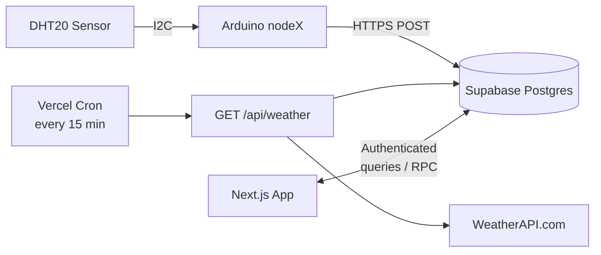
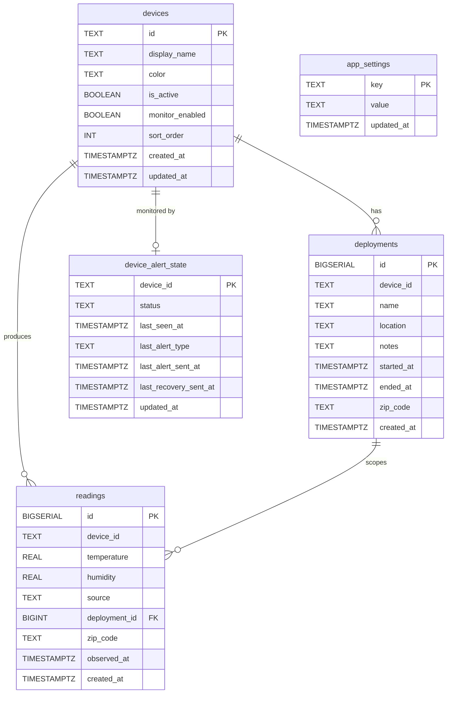

# System Architecture

Full data path from sensor read to dashboard consumption.

## 1) Scope

- Hardware: N Arduino Uno R4 WiFi nodes with DHT20 sensors (I2C) and 16x2 LCDs. The number of nodes is not hardcoded — new devices are registered through the web dashboard or auto-registered on first reading.
- Cloud: Supabase Postgres (`readings`, `deployments`, `devices`, `app_settings`, `device_alert_state`, `user_roles`, RPC functions) + WeatherAPI.com for every-15-min weather reference.
- App: Next.js with authenticated dashboard, charts, comparisons, deployment management, device management, AI chat, in-browser Python analysis, and cron-driven weather ingestion.

## 2) Component Topology



Nodes are dynamically registered in the `devices` table. The dashboard, keepalive, and weather routes all read from this table to determine which devices exist and which are active.

## 3) Sensor Node Pipeline

### 3.1 Read

- DHT20 temperature + humidity every `READ_INTERVAL_MS = 15000` (15s).
- I2C address `0x38` on `SDA`/`SCL`.
- Invalid reads (`NaN`) are discarded.

### 3.2 Aggregation

- Successful reads accumulate in local sums.
- Every `SEND_INTERVAL_MS = 180000` (3 min), compute average temperature (C) and humidity (%).

### 3.3 Uplink

- One HTTPS POST per 3-minute window to `/rest/v1/readings`:

```json
{
  "device_id": "node1",
  "temperature": 22.55,
  "humidity": 45.15
}
```

- `created_at` set server-side by Supabase.
- On success: accumulators reset, timer restarts.
- On failure: buffer is retained and the node retries with linear backoff (30s, 60s, 90s, 120s... capped at `SEND_INTERVAL_MS`). No data is lost during transient network issues.

## 4) Persistence Layer (Supabase)

### 4.1 Tables

**`readings`**
- `id` (bigserial PK), `device_id`, `temperature` (C), `humidity`, `created_at`, `source`, `deployment_id`, `zip_code`, `observed_at`
- `source` constrained to `sensor` (default) or `weather`
- Weather inserts use `device_id = weather_<sensor_device_id>`
- Index on `(device_id, created_at DESC)`
- Soft dedup on 15-minute buckets in route code; DB unique index on `(device_id, quarter_hour(created_at UTC))` as fallback for `source = weather`

**`deployments`**
- Placement window metadata: `device_id`, `name`, `location`, `zip_code`, `notes`, `started_at`, `ended_at`
- Optional unique-active constraint per `device_id` where `ended_at IS NULL`
- Overlap exclusion constraint prevents conflicting time windows per device

**`devices`**
- Device registry: `id` (primary key), `display_name`, `color`, `is_active`, `monitor_enabled`, `sort_order`, `created_at`, `updated_at`
- Managed through the Device Manager UI on the dashboard
- `is_active` controls visibility in the dashboard; `monitor_enabled` controls keepalive alerting
- Auto-registration trigger creates a `devices` row when a new `device_id` appears in `readings` (gated behind `app_settings.device_auto_register = 'true'`)
- Seeded with `node1` and `node2` on first schema run; backfills from existing readings and deployments

**`app_settings`**
- Key-value feature flags (e.g., `device_auto_register`)
- Authenticated users can read; updates require authenticated session

**`device_alert_state`**
- Per-device monitor state: `status`, `last_seen_at`, `last_alert_sent_at`, `last_recovery_sent_at`
- Keepalive route uses this to deduplicate incident and recovery notifications

### 4.2 Security (RLS)

RLS enabled on all tables.

| Table | `anon` | `authenticated` | `service_role` |
|-------|--------|-----------------|----------------|
| `readings` | INSERT | SELECT | DELETE |
| `deployments` | — | Full CRUD | — |
| `devices` | — | Full CRUD | — |
| `app_settings` | — | SELECT, UPDATE | — |
| `device_alert_state` | — | SELECT | (service_role bypasses RLS; keepalive upserts via service_role) |

`/api/weather` uses service_role + `CRON_SECRET`.

### 4.3 RPC Functions

| Function | Purpose |
|----------|---------|
| `get_device_stats(start, end, device_id?)` | Aggregate avg/min/max/stddev/count by device |
| `get_chart_samples(start, end, bucket_min, device_id?)` | Time-bucketed averages for charts |
| `get_deployment_stats(deployment_ids[])` | Deployment-scoped aggregates via time window |
| `get_deployment_readings(deployment_id, limit?)` | Raw readings within a deployment window |
| `get_deployments_with_counts(device_id?, active_only?)` | Deployments with reading counts |
| `get_dashboard_live(device_ids[], sparkline_start, bucket_min?)` | Batched latest readings + sparkline per N devices |
| `delete_deployment_cascade(deployment_id)` | Cascade-delete deployment and its readings |
| `delete_readings_range(device_id, start, end, include_weather?)` | Scoped deletion of readings by device and time range |

Weather data lives in `readings`, so all RPCs work with weather device IDs (e.g., `weather_node1`).

### 4.4 Schema Diagram



## 5) Web Application

All pages require Supabase Auth session (`AuthGate`). The root layout wraps the app in `ThemeProvider` > `AuthProvider` > `PostHogProviderWrapper` > `DevicesProvider` > `ChatPageContextProvider`, making the device list, analytics, and chat context available everywhere.

Auth supports two roles: `admin` and `user`. Roles are stored in a `user_roles` table and injected into the JWT via a Custom Access Token Hook. Both roles have the same data access (all authenticated users see all data). The role distinction controls admin-only UI (user management). A middleware layer (`middleware.ts`) refreshes sessions and redirects unauthenticated users to `/login`.

Optional PostHog integration provides product analytics (autocapture, session replay, error tracking) when `NEXT_PUBLIC_POSTHOG_KEY` is configured. Traffic routes through a managed reverse proxy to bypass ad blockers. PostHog is not required — if the env var is unset, the provider renders children without instrumentation.

### 5.1 Dashboard (`/`)

- Polls every 30s using `get_dashboard_live` RPC (batched query for all active devices).
- Renders live cards per device with deployment context, weather comparison, and 6h sparklines.
- `DashboardStats`: 24h aggregates (avg temp, high/low, uptime %, sensor accuracy vs weather). Uptime is computed per device based on active deployment start time.
- Offline notification banner: queries `device_alert_state` table and shows a warning when any device is stale/missing/anomaly. Dismissible per session.
- Device Manager modal: add/edit/deactivate devices, toggle monitoring, assign colors.
- Floating `ChatShell` available on all pages (mounted in root layout).

### 5.2 Charts (`/charts`)

- Time range: preset, custom, or deployment window.
- Bucket size dynamically chosen targeting ~100 data points: 5min for short ranges, 15min for 24h, 2-3h for 7d.
- CSV export fetches raw readings, excludes `weather_*` rows. Export modal supports deployment selection (auto-fills dates/device, prepends CSV metadata headers).
- Save PNG button exports the chart as a 2x resolution PNG image for reports.

### 5.3 Compare (`/compare`)

- Dynamically fetches `get_device_stats` for all active sensor + weather device pairs.
- Displays Weather row and `% Error` row per metric.
- `% Error` = each sensor node vs its local weather counterpart (not node vs node).
- Celsius converted to Fahrenheit for display.

### 5.4 Deployments (`/deployments`)

- CRUD for deployment metadata with device/location/status filters.
- Device filter populated from the `devices` table.
- Optional ZIP code (`12345` or `12345-6789`) for weather lookups.
- Deletion removes associated readings in the deployment time window.
- Clean Up Data modal: scoped deletion of readings by device + time range with password re-entry confirmation. Uses `delete_readings_range` RPC.

### 5.5 Analysis (`/analysis`)

- Pyodide runtime loaded from CDN (singleton, cached after first load).
- Packages: `numpy`, `pandas`, `scipy`, `statsmodels`.
- Selected deployment readings fetched via Supabase, capped at 5000 rows per deployment.
- Analyses: descriptive stats (with standard error), correlation, hypothesis testing (95% CI for difference in means), ANOVA with Tukey HSD post-hoc (auto-runs for 3+ deployments), seasonal decomposition, forecasting.
- Per-section CSV download buttons for all analysis results.
- All computation runs client-side.

### 5.6 AI Chat (`POST /api/chat`)

- Authenticated route using Gemini 2.5 Flash with function-calling.
- 7 tools: `get_deployments`, `get_deployment_stats`, `get_readings`, `get_device_stats`, `get_chart_data`, `get_report_data`, `get_weather`.
- Tools execute via `aiTools.ts` with service-role Supabase client.
- Tool result payloads capped at 30KB to prevent overwhelming model context; large arrays are truncated with guidance to use aggregate tools.
- Tool loop bounded at 10 iterations; on exhaustion, model is prompted to summarize gathered data rather than failing silently.
- `get_device_stats` has optional `start`/`end` (defaults to last 30 days) to reduce unnecessary tool calls.
- `get_readings` supports `order_by` (`created_at`, `temperature`, `humidity`) and `ascending` params for finding extreme values across full datasets.
- System prompt includes efficiency rules prioritizing single-call patterns (e.g., one `get_device_stats` call for device comparisons).
- Streaming via `TransformStream` with `__STATUS__` markers for tool-call progress.
- Client-side word drip renders streamed text at ~48 words/sec for smooth token-by-token display.
- In-memory rate limiting: 30 requests per 15 min per user (resets on deploy).
- Page context injected into system prompt from `ChatPageContextProvider`.
- Returns Fahrenheit fields and `America/Phoenix` local time.
- Accessed via floating `ChatShell` component with open/close animation, auto-scroll, and scroll-for-more indicator.

### 5.7 Keepalive (`GET /api/keepalive`)

- `CRON_SECRET`-protected, runs every 10 min.
- Reads monitored devices from the `devices` table (`is_active = true` and `monitor_enabled = true`). Falls back to `MONITORED_DEVICE_IDS` env var if set.
- Classifies each device: `ok`, `missing`, `stale`, `anomaly`.
- Sends one alert per state transition via Resend (no repeat spam).
- Optional recovery alert on return to `ok`.

### 5.8 Weather Ingestion (`GET /api/weather`)

- Every-15-min cron (`0,15,30,45 * * * *`), `CRON_SECRET`-protected.
- Reads active deployments with non-null `zip_code`.
- Normalizes/validates ZIPs, deduplicates API calls by ZIP.
- Writes one weather row per tracked device with `source = weather`, `deployment_id`, `zip_code`, `observed_at`.
- Idempotent per device per 15-minute UTC bucket.
- Returns: `fetched_count`, `inserted_count`, `skipped_existing_count`, `invalid_zip_count`, errors.

### 5.9 API Reference

| Route | Method | Auth | Purpose |
|-------|--------|------|---------|
| `/api/chat` | POST | Supabase session | AI chat with Gemini 2.5 Flash. Accepts `{ message, history }`. Streams response with `__STATUS__` markers for tool-call progress. Rate-limited to 30 req/15 min per user. |
| `/api/keepalive` | GET | `CRON_SECRET` header | Device health monitor. Classifies devices as ok/missing/stale/anomaly. Sends email alerts on state transitions via Resend. Returns per-device status summary. |
| `/api/weather` | GET | `CRON_SECRET` header | Weather ingestion cron. Fetches current conditions from WeatherAPI.com for each active deployment ZIP. Writes `source=weather` rows. Idempotent per 15-min UTC bucket. Returns fetch/insert/skip counts. |
| `/api/users` | GET/POST/PATCH/DELETE | Admin only (Supabase session) | User management. GET lists all users with roles. POST invites by email or generates a copy-able invite link (`linkOnly: true`). PATCH updates user role. DELETE removes a user. All mutations require admin role. |

## 6) Data Semantics

- Storage: Celsius. Display: Fahrenheit.
- Sensor device IDs: any valid ID registered in the `devices` table (e.g., `node1`, `node2`, `patio_sensor`).
- Weather device IDs: `weather_<sensor_device_id>` (e.g., `weather_node1`).
- `source = sensor` = Arduino. `source = weather` = WeatherAPI.
- Sensor readings associate to deployments via `device_id + timestamp` window.
- Weather rows store `deployment_id` and `zip_code` for traceability.

## 7) Timing

| Component | Cadence |
|-----------|---------|
| Sensor read | 15s |
| Sensor upload | 3 min (averaged) |
| Weather fetch | Every 15 min (per unique ZIP) |
| Dashboard poll | 30s |
| Keepalive | 10 min |
| Chart bucketing | Postgres RPC, adaptive |

## 8) Failure Modes

| Failure | Behavior |
|---------|----------|
| WiFi disconnect | Firmware reconnects |
| Bad sensor read | Skipped, window continues |
| Upload failure | Buffer retained, retry with linear backoff (30s, 60s, 90s... capped at send interval) |
| Supabase/RPC error | Logged, empty-state fallback |
| Missing `WEATHER_API_KEY` | Non-throwing `ok: false` response |
| WeatherAPI per-ZIP error | Logged, remaining ZIPs continue |
| Duplicate weather insert | `23505` counted as skipped |
| Pyodide load failure | Retry action surfaced |

## 9) Trust Boundaries

| Boundary | Mechanism |
|----------|-----------|
| Device | Anon key, INSERT-only |
| Browser | Anon client + authenticated session for reads/RPC |
| Server | Service role on server only; `/api/chat` checks auth; `/api/users` requires admin role; cron routes check `CRON_SECRET` |

## 10) Source Files

| Area | Files |
|------|-------|
| Firmware | `arduino/sensor_node/sensor_node.ino` |
| Schema | `supabase/schema.sql` |
| Supabase client | `web/src/lib/supabase/` (types, client, server, queries) |
| Device management | `web/src/components/DeviceManager.tsx`, `web/src/contexts/DevicesContext.tsx`, `web/src/lib/supabase/queries/devices.ts` |
| Pages | `web/src/app/{page,charts,compare,deployments,analysis}/page.tsx` |
| AI | `web/src/app/api/chat/route.ts`, `web/src/lib/aiTools.ts`, `web/src/components/ChatShell.tsx`, `web/src/lib/chatContext.tsx` |
| Keepalive | `web/src/app/api/keepalive/route.ts` |
| Weather | `web/src/app/api/weather/route.ts`, `web/src/lib/weatherZip.ts`, `web/src/lib/weatherCompare.ts` |
| Analysis | `web/src/lib/pyodide.ts`, `web/src/lib/analysisRunner.ts` |
| Dashboard extras | `web/src/components/DashboardStats.tsx` |
| User management | `web/src/app/api/users/route.ts`, `web/src/components/UserManager.tsx` |
| Auth / roles | `web/src/components/AuthProvider.tsx`, `web/src/lib/serverAuth.ts`, `web/src/middleware.ts` |
| Analytics (optional) | `web/src/components/PostHogProvider.tsx`, `web/src/lib/posthog-server.ts` |
